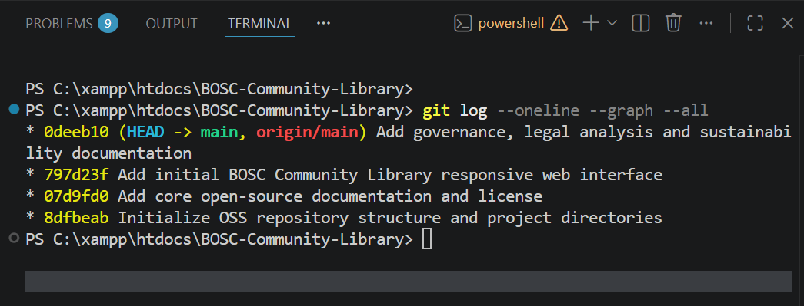
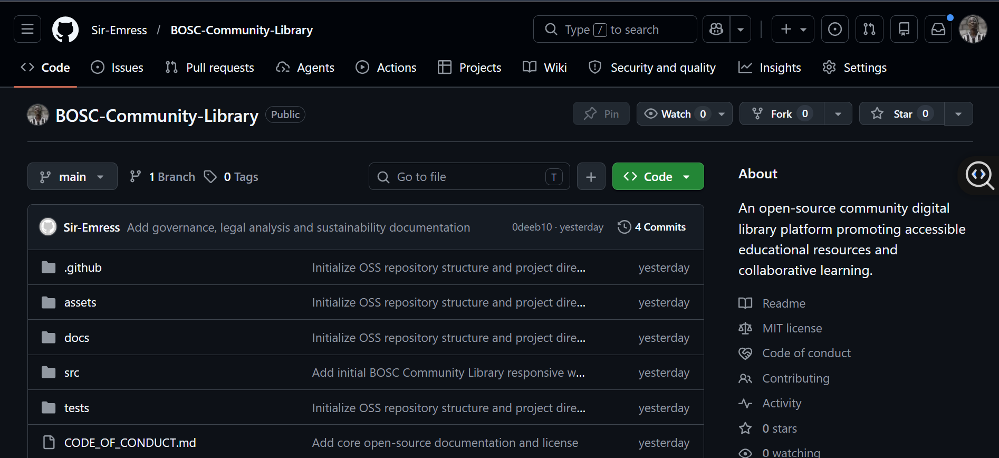
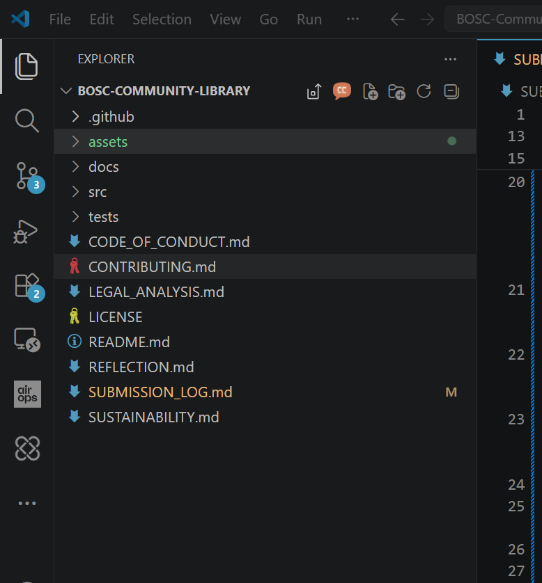
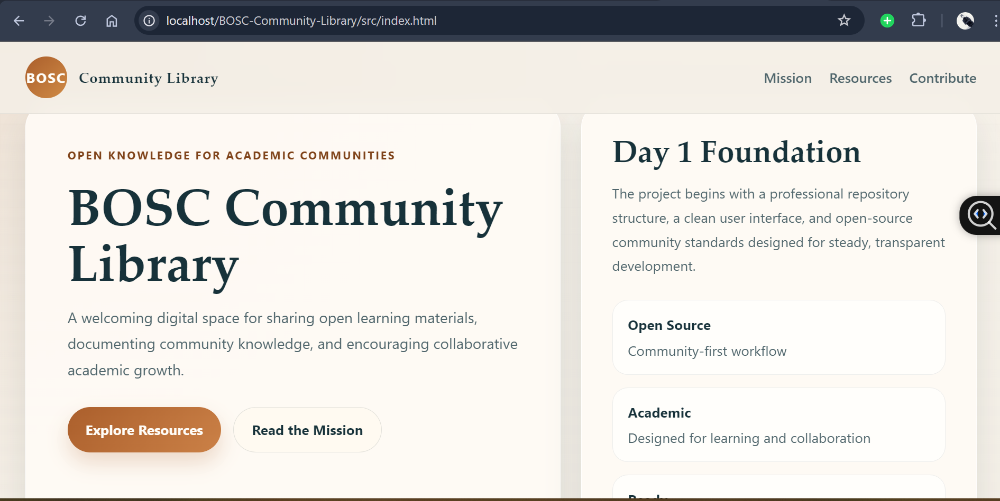

# BOSC Community Library - Submission Audit Log

This document serves as the official academic audit log for the `BOSC-Community-Library` project. It is structured to support real daily updates over a 7-day development cycle and should be maintained alongside the repository as evidence of authentic open-source workflow activity.

## 1. Project Overview

`BOSC-Community-Library` is a university open-source software project focused on building a community-oriented digital library interface for sharing academic resources, open learning materials, and contributor knowledge. The system is being developed incrementally to reflect practical repository management, documentation governance, and collaborative software engineering.

- Project purpose: To provide a maintainable foundation for a community library platform while demonstrating professional open-source development practices.
- System scope: Repository governance, documentation, frontend interface development, issue tracking, pull request workflow, and audit evidence collection.
- Role: Lead Community Maintainer responsible for coordinating repository setup, maintaining community standards, guiding contribution workflow, reviewing development evidence, and preserving the integrity of the submission record.

## 2. Development Timeline (7-Day Plan Tracking)

### Day 1 - Repository Initialization (COMPLETED)

- Date recorded: `2026-05-08`
- Connected the local repository to the GitHub remote: `https://github.com/Sir-Emress/BOSC-Community-Library.git`
- Set up the project structure in `C:\xampp\htdocs\BOSC-Community-Library`
- Added core OSS documentation, including `README.md`, `CONTRIBUTING.md`, `CODE_OF_CONDUCT.md`, `LICENSE`, `LEGAL_ANALYSIS.md`, `SUSTAINABILITY.md`, and `REFLECTION.md`
- Created GitHub collaboration templates in `.github/ISSUE_TEMPLATE/` and `.github/pull_request_template.md`
- Built the initial frontend UI in `src/index.html`, `src/style.css`, and `src/script.js`
- Initialized the Git workflow on the `main` branch and recorded the foundational Day 1 commits

### Day 2 - Legal Analysis and Compliance (TO BE UPDATED)

- Planned focus: Legal analysis work
- Daily activity summary: TO BE UPDATED
- Git commits recorded: TO BE UPDATED
- Issues or pull requests linked: TO BE UPDATED
- Screenshots captured: TO BE UPDATED

### Day 3 - Issue Tracking and Bug Fixes (TO BE UPDATED)

- Planned focus: Issue tracking and bug fixes
- Daily activity summary: TO BE UPDATED
- Git commits recorded: TO BE UPDATED
- Issues or pull requests linked: TO BE UPDATED
- Screenshots captured: TO BE UPDATED

### Day 4 - Feature Enhancements (TO BE UPDATED)

- Planned focus: Feature enhancements
- Daily activity summary: TO BE UPDATED
- Git commits recorded: TO BE UPDATED
- Issues or pull requests linked: TO BE UPDATED
- Screenshots captured: TO BE UPDATED

### Day 5 - Feature Enhancements (TO BE UPDATED)

- Planned focus: Feature enhancements
- Daily activity summary: TO BE UPDATED
- Git commits recorded: TO BE UPDATED
- Issues or pull requests linked: TO BE UPDATED
- Screenshots captured: TO BE UPDATED

### Day 6 - Refactoring and Sustainability Updates (TO BE UPDATED)

- Planned focus: Refactoring and sustainability updates
- Daily activity summary: TO BE UPDATED
- Git commits recorded: TO BE UPDATED
- Issues or pull requests linked: TO BE UPDATED
- Screenshots captured: TO BE UPDATED

### Day 7 - Final Submission Audit and Reflection (TO BE UPDATED)

- Planned focus: Final submission audit and reflection
- Daily activity summary: TO BE UPDATED
- Git commits recorded: TO BE UPDATED
- Issues or pull requests linked: TO BE UPDATED
- Screenshots captured: TO BE UPDATED

## 3. Git Activity Log

Record commits exactly as shown in Git history. Preserve commit hashes, dates, and messages to maintain audit integrity.

### Day 1 Git Commits

- `8dfbeab` - `2026-05-08` - Initialize OSS repository structure and project directories
- `07d9fd0` - `2026-05-08` - Add core open-source documentation and license
- `797d23f` - `2026-05-08` - Add initial BOSC Community Library responsive web interface
- `0deeb10` - `2026-05-08` - Add governance, legal analysis and sustainability documentation

### Day 2 Git Commits (TO BE UPDATED)

- TO BE UPDATED

### Day 3 Git Commits (TO BE UPDATED)

- TO BE UPDATED

### Day 4 Git Commits (TO BE UPDATED)

- TO BE UPDATED

### Day 5 Git Commits (TO BE UPDATED)

- TO BE UPDATED

### Day 6 Git Commits (TO BE UPDATED)

- TO BE UPDATED

### Day 7 Git Commits (TO BE UPDATED)

- TO BE UPDATED

## 4. Screenshots Evidence Section

This section preserves visual evidence captured during actual development activity. All embedded images below are drawn from the project repository and are included to support the authenticity, traceability, and professional presentation of Day 1 open-source workflow evidence.

### Day 1 Screenshots

The following authenticated screenshots document key Day 1 milestones in version control, repository hosting, workspace organization, and local execution.

### Git Commit History

**Description:**  
This screenshot captures the Git commit history generated using `git log --oneline --graph --all`.

It demonstrates incremental repository initialization and professional commit workflow practices. It is relevant to OSS workflow assessment because it provides traceable evidence of structured version control activity completed during Day 1.

---

### GitHub Repository Overview

**Description:**  
This screenshot presents the GitHub repository overview for `BOSC-Community-Library`, showing the hosted project environment used for remote version control and public-facing repository management.

It is relevant to OSS workflow assessment because it confirms repository visibility, remote integration, and the use of standard GitHub collaboration infrastructure expected in open-source development.

---

### VS Code Project Structure

**Description:**  
This screenshot documents the project structure as organized in Visual Studio Code, including documentation files, governance materials, source files, and repository support directories.

It is relevant to OSS workflow assessment because it evidences maintainable repository organization, early documentation discipline, and clear separation of project assets required for sustainable collaborative development.

---

### Running Localhost Application

**Description:**  
This screenshot shows the Day 1 frontend interface running locally through the XAMPP environment using the project path under `htdocs`.

It is relevant to OSS workflow assessment because it confirms that the initial frontend environment was operational, testable in local development, and supported by a functioning deployment preview workflow.

---

### Day 2 to Day 7 Screenshots (TO BE UPDATED)

- GitHub issue creation and resolution
- Pull request discussions
- Branch history
- Contribution graph on GitHub
- Feature implementation progress

## 5. Day 1 Completion Summary

Day 1 development activity concluded with the successful establishment of the repository foundation and supporting audit evidence. The project reached a stable baseline suitable for continued staged development and academic review.

- Repository initialized successfully with foundational project directories and tracked source files.
- GitHub integration completed through connection of the local repository to the configured remote origin.
- OSS governance files established, including contributor guidance, conduct standards, licensing, legal review, sustainability notes, and project reflection materials.
- Frontend environment operational via XAMPP, with the initial interface running locally from the `src/` directory.
- Audit evidence captured successfully through commit history, repository overview, editor structure, and localhost execution screenshots.

## 6. Evidence Storage Notes

- All Day 1 screenshots are stored in `assets/screenshots/` and embedded in this document using repository-relative Markdown paths.
- Screenshots were captured progressively during development rather than reconstructed after completion.
- The evidence archive supports the authenticity of workflow activity by linking visual proof to real repository, development environment, and version control milestones.
- Future evidence for Days 2 to 7 should be stored using the same organized structure to preserve consistency across the full audit timeline.

## 7. Issues and Pull Request Tracking

Update this section only after the issue or pull request exists on GitHub. Replace `TO BE UPDATED` with the real title, link, status, and resolution details.

### Issues Created

| Issue Ref | Category | Title / Link | Status |
| --- | --- | --- | --- |
| Issue 1 | Functional Bug Fix | TO BE UPDATED | TO BE UPDATED |
| Issue 2 | Functional Bug Fix | TO BE UPDATED | TO BE UPDATED |
| Issue 3 | Feature Enhancement | TO BE UPDATED | TO BE UPDATED |
| Issue 4 | Feature Enhancement | TO BE UPDATED | TO BE UPDATED |
| Issue 5 | Refactoring Task | TO BE UPDATED | TO BE UPDATED |

### Pull Requests

| PR Ref | Linked Issue | Title / Link | Status |
| --- | --- | --- | --- |
| PR 1 | Issue 1 | TO BE UPDATED | TO BE UPDATED |
| PR 2 | Issue 2 | TO BE UPDATED | TO BE UPDATED |
| PR 3 | Issue 3 | TO BE UPDATED | TO BE UPDATED |
| PR 4 | Issue 4 | TO BE UPDATED | TO BE UPDATED |
| PR 5 | Issue 5 | TO BE UPDATED | TO BE UPDATED |

## 8. Audit Compliance Notes

- This project follows a 7-day incremental development model aligned with academic open-source project assessment.
- All commits should be distributed across the development timeline rather than uploaded in a single batch.
- Screenshots should be captured daily and stored as authentic evidence of actual work completed.
- GitHub issue activity, pull request history, and the contribution graph form part of the official assessment evidence.
- Audit entries should be updated immediately after each work session to preserve accuracy and traceability.

## 9. Contribution Integrity Statement

> "This submission represents an iterative open-source development process demonstrating real-world repository management, issue tracking, and collaborative software engineering practices."
