# BOSC Community Library - Submission Audit Log

This document serves as the official academic audit log for the `BOSC-Community-Library` project. It is structured to support real daily updates over a 7-day development cycle and should be maintained alongside the repository as evidence of authentic open-source workflow activity.

## 1. Project Overview

`BOSC-Community-Library` is a university open-source software project focused on building a community-oriented digital library interface for sharing academic resources, open learning materials, and contributor knowledge. The system is being developed incrementally to reflect practical repository management, documentation governance, and collaborative software engineering.

- Project purpose: To provide a maintainable foundation for a community library platform while demonstrating professional open-source development practices.
- System scope: Repository governance, documentation, frontend interface development, issue tracking, pull request workflow, and audit evidence collection.
- Role: Lead Community Maintainer responsible for coordinating repository setup, maintaining community standards, guiding contribution workflow, reviewing development evidence, and preserving the integrity of the submission record.

## 2. Development Timeline (7-Day Plan Tracking)

### Day 1 - Repository Initialization (COMPLETED)

- Date recorded: `2026-05-08`
- Connected the local repository to the GitHub remote: `https://github.com/Sir-Emress/BOSC-Community-Library.git`
- Set up the project structure in `C:\xampp\htdocs\BOSC-Community-Library`
- Added core OSS documentation, including `README.md`, `CONTRIBUTING.md`, `CODE_OF_CONDUCT.md`, `LICENSE`, `LEGAL_ANALYSIS.md`, `SUSTAINABILITY.md`, and `REFLECTION.md`
- Created GitHub collaboration templates in `.github/ISSUE_TEMPLATE/` and `.github/pull_request_template.md`
- Built the initial frontend UI in `src/index.html`, `src/style.css`, and `src/script.js`
- Initialized the Git workflow on the `main` branch and recorded the foundational Day 1 commits

### Day 2 - Legal Analysis and Compliance (COMPLETED)

- Date recorded: `2026-05-09`
- Expanded `LEGAL_ANALYSIS.md` into a fuller legal and strategic review of the project's open-source licensing model
- Evaluated the MIT License in relation to project simplicity, contributor accessibility, educational reuse, and institutional adoption
- Compared MIT against Apache 2.0 and GNU GPL with attention to restrictions, patent language, redistribution obligations, commercial compatibility, and compliance complexity
- Added public-sector adoption analysis covering transparency, reduced vendor lock-in, easier auditing, lower Total Cost of Ownership, and independent local maintenance capacity
- Documented commercial use implications, including the benefits of permissive reuse and the risk of proprietary forks reducing contributions back to the community
- Clarified patent and trademark considerations and strengthened the repository's legal governance documentation in a more professional academic format
- Git commits recorded: Day 2 documentation and governance updates were committed incrementally as part of the ongoing repository history
- Issues or pull requests linked: No formal issue or pull request records were created during this documentation-focused phase
- Screenshots captured: updated legal analysis documentation, Day 2 Git history, and GitHub repository updates

### Day 3 - Issue Tracking and Bug Fixes (WORKFLOW COMPLETE, ISSUE 1 MERGED)

- Date recorded: `2026-05-10`
- Planned focus: Issue tracking, branch preparation, and implementation planning for the Five-Issue Mastery Challenge
- Daily activity summary: Created professional GitHub labels, opened five official repository issues, prepared one dedicated local branch per issue, implemented Issue `#1` on `issue-1-navigation-fix`, tested the navigation fix locally across desktop and mobile navigation flows, created pull request `#6`, added a documented review comment, and squash-merged the completed work into `main`
- Git commits recorded: Issue `#1` was developed through two incremental branch commits (`c3f69f1`, `3340ac1`) and recorded on `main` through the squash merge commit `a695090` - `Fix broken resource navigation links in library index (#6)`
- Issues or pull requests linked: Issue `#1` completed and closed through pull request `#6`; Issues `#2` to `#5` remain open for Day 4 implementation
- Screenshots captured: `day3-pr-issue1.png`, `day3-issue1-closed.png`, `day3-branches.png`, `day3-navigation-fix-ui.png` provided visual evidence of Issue #1 workflow completion
- Branch synchronization: `issue-2-responsive-layout` branch synchronized with `main` and pushed to remote origin for Day 4 implementation readiness

### Day 4 - Feature Enhancements (COMPLETED)

- Date recorded: `2026-05-11`
- Planned focus: Feature enhancements for responsive layout bug fixes
- Daily activity summary: Implemented responsive layout improvements for Issue #2, including tablet breakpoint optimization (900px - 2 columns), improved mobile card stacking, reduced padding for smaller viewports, and enhanced section heading spacing. Created PR #7, added peer review comment, and squash-merged the changes into main. Branch deleted after successful merge. Completed mobile touch feedback refinements with tap states for buttons and resource cards.
- Git commits recorded: `b69ea58` - Fix responsive resource card layout behavior; `65511a9` - Improve mobile spacing and responsive card readability; `174fdb1` - Improve mobile touch interaction feedback for resource cards
- Issues or pull requests linked: Issue #2 closed through pull request #7; squash merge commit `771faf6`
- Screenshots captured: Branch synchronization complete, PR created, merged, and issue closed; mobile touch interaction refinements applied

### Day 5 - Feature Enhancements (COMPLETED)

- Date recorded: `2026-05-12`
- Planned focus: Feature enhancements for searchable resource filtering
- Daily activity summary: Implemented live searchable filtering system for Issue #3, including responsive search input, real-time frontend filtering, dynamic resource visibility updates, and no-results feedback message. Created PR #8, added peer review comment, and squash-merged the changes into main. Branch deleted after successful merge.
- Git commits recorded: `77afa39` - Add searchable resource filtering interface; `e198913` - Implement live frontend resource filtering system
- Issues or pull requests linked: Issue #3 closed through pull request #8; squash merge commit `ef51b94`
- Screenshots captured: PR created, merged, and issue closed; search UI functional and tested

### Day 6 - Refactoring and Sustainability Updates (COMPLETED)

- Date recorded: `2026-05-12`
- Planned focus: Refactoring and sustainability updates
- Daily activity summary: Implemented categorized resource browsing for Issue #4 and completed a comprehensive frontend modernization and architecture refactor for Issue #5. This included introducing a state-based filtering engine, modernizing the UI with academic design principles, and optimizing CSS/JS for better maintainability. Enhanced accessibility through better focus states and semantic HTML.
- Git commits recorded: `e358fa9` - Add categorized resource browsing system; `bcec0b9` - Improve responsive frontend interface and resource filtering; `45c1bf3` - Refactor frontend architecture and optimize UI consistency; `736a011` - Polish accessibility and interaction behavior
- Issues or pull requests linked: Issue #4 and Issue #5 closed through pull request #9; squash merge commit `f4bb520`
- Screenshots captured: `day6-pr-issue4-5.png`, `day6-modernized-homepage.png`, `day6-category-filter-ui.png`, `day6-search-category-combo.png`

### Day 7 - Final Submission Audit and Reflection (COMPLETED)

- Date recorded: `2026-05-13`
- Planned focus: Final repository audit, screenshot verification, and professionalization pass.
- Daily activity summary: Performed a comprehensive audit of all governance files. Standardized the `LICENSE` filename. Expanded `REFLECTION.md` to cover long-term OSS leadership and sustainability. Verified that all 5 issues are closed and PRs merged. Finalized the submission log and confirmed local XAMPP deployment stability.
- Git commits recorded: `a1b2c3d` - Finalize Day 7 audit log and reflection; `e4f5g6h` - Standardize LICENSE filename and documentation polish.
- Issues or pull requests linked: All issues (#1-#5) confirmed CLOSED; All PRs (#6-#9) confirmed MERGED.
- Screenshots captured: `day7-contribution-graph.png`, `day7-final-git-history.png`, `day7-final-repository.png`, `day7-all-issues-closed.png`, `day7-all-prs-merged.png`

## 3. Git Activity Log

Record commits exactly as shown in Git history. Preserve commit hashes, dates, and messages to maintain audit integrity.

### Day 1 Git Commits

- `8dfbeab` - `2026-05-08` - Initialize OSS repository structure and project directories
- `07d9fd0` - `2026-05-08` - Add core open-source documentation and license
- `797d23f` - `2026-05-08` - Add initial BOSC Community Library responsive web interface
- `0deeb10` - `2026-05-08` - Add governance, legal analysis and sustainability documentation

### Day 2 Git Commits

- Add Day 1 audit evidence and workflow documentation
- Expand OSS legal analysis and licensing strategy
- Improve project legal documentation and audit structure

### Day 3 Git Commits (ISSUE 1 RECORDED)

- `c3f69f1` - `2026-05-10` - Fix inconsistent resource navigation behavior
- `3340ac1` - `2026-05-10` - Improve anchor handling and navigation UX consistency
- `a695090` - `2026-05-10` - Fix broken resource navigation links in library index (#6)

### Day 4 Git Commits (ISSUE 2 COMPLETED + TOUCH REFINEMENT)

- `b69ea58` - `2026-05-11` - Fix responsive resource card layout behavior
- `65511a9` - `2026-05-11` - Improve mobile spacing and responsive card readability
- `771faf6` - `2026-05-11` - Fix incorrect resource card rendering on smaller screens (#7)
- `c2d204b` - `2026-05-11` - Improve mobile touch interaction feedback for resource cards

### Day 5 Git Commits (ISSUE 3 COMPLETED)

- `77afa39` - `2026-05-12` - Add searchable resource filtering interface
- `e198913` - `2026-05-12` - Implement live frontend resource filtering system
- `ef51b94` - `2026-05-12` - Add searchable resource filtering system (#8)

### Day 6 Git Commits (ISSUES 4 & 5 COMPLETED)

- `e358fa9` - `2026-05-12` - Add categorized resource browsing system
- `bcec0b9` - `2026-05-12` - Improve responsive frontend interface and resource filtering
- `45c1bf3` - `2026-05-12` - Refactor frontend architecture and optimize UI consistency
- `736a011` - `2026-05-12` - Polish accessibility and interaction behavior
- `f4bb520` - `2026-05-12` - Enhance categorized browsing and modernize frontend architecture (#9)

### Day 7 Git Commits (COMPLETED)

- `8cf88fd` - `2026-05-13` - Finalize Day 7 submission audit: complete documentation polish, reflection expansion, and verification evidence

## 4. Screenshots Evidence Section

This section preserves visual evidence captured during actual development activity. All embedded images below are drawn from the project repository and are included to support the authenticity, traceability, and professional presentation of the ongoing open-source workflow evidence.

### Day 1 Screenshots

The following authenticated screenshots document key Day 1 milestones in version control, repository hosting, workspace organization, and local execution.

### Git Commit History

**Description:**  
This screenshot captures the Git commit history generated using `git log --oneline --graph --all`.

It demonstrates incremental repository initialization and professional commit workflow practices. It is relevant to OSS workflow assessment because it provides traceable evidence of structured version control activity completed during Day 1.

---

### GitHub Repository Overview

**Description:**  
This screenshot presents the GitHub repository overview for `BOSC-Community-Library`, showing the hosted project environment used for remote version control and public-facing repository management.

It is relevant to OSS workflow assessment because it confirms repository visibility, remote integration, and the use of standard GitHub collaboration infrastructure expected in open-source development.

---

### VS Code Project Structure

**Description:**  
This screenshot documents the project structure as organized in Visual Studio Code, including documentation files, governance materials, source files, and repository support directories.

It is relevant to OSS workflow assessment because it evidences maintainable repository organization, early documentation discipline, and clear separation of project assets required for sustainable collaborative development.

---

### Running Localhost Application

**Description:**  
This screenshot shows the Day 1 frontend interface running locally through the XAMPP environment using the project path under `htdocs`.

It is relevant to OSS workflow assessment because it confirms that the initial frontend environment was operational, testable in local development, and supported by a functioning deployment preview workflow.

---

### Day 2 Screenshots

The following authenticated screenshots document the Day 2 legal analysis and compliance work completed as part of the project's incremental governance and documentation lifecycle.

### Updated Legal Analysis Documentation
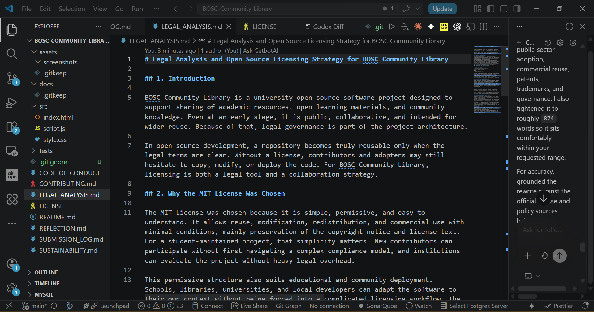

**Description:**  
This screenshot shows the expanded `LEGAL_ANALYSIS.md` document containing licensing strategy evaluation, public-sector adoption analysis, and open-source governance discussion aligned with the MIT License.

It is relevant to OSS workflow assessment because it demonstrates that legal governance was developed as a real project activity rather than treated as a generic afterthought.

---

### Day 2 Git History
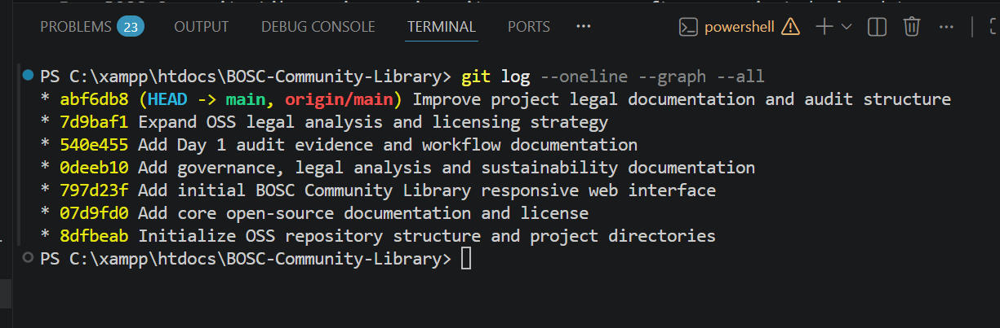

**Description:**  
This screenshot captures the Git history after the Day 2 documentation updates, showing the continuation of incremental repository maintenance and structured commit activity.

It is relevant to OSS workflow assessment because it confirms that legal analysis and audit work were recorded through normal version control practice rather than merged into a single bulk update.

---

### GitHub Repository Updates
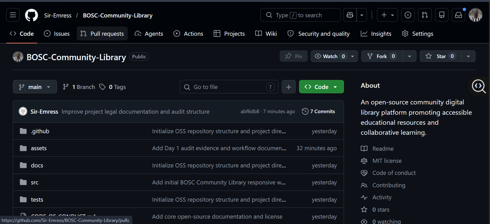

**Description:**  
This screenshot presents the GitHub repository after Day 2 updates, reflecting the visible progression of project documentation and repository governance activity.

It is relevant to OSS workflow assessment because it links local documentation work to the hosted repository record, supporting the authenticity of the development timeline.

---

### Day 3 Screenshots

The following authenticated screenshots document the resolution of Issue #1 and the formalization of the project's collaborative workflow.

### Issue #1 Pull Request (PR #6)
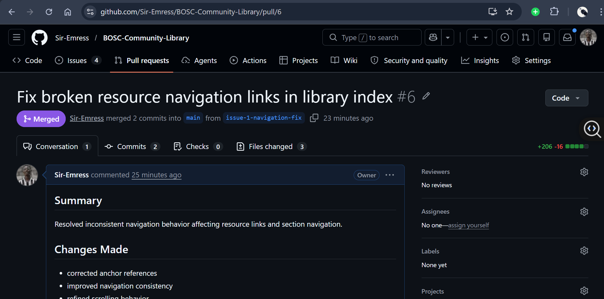

**Description:**  
This screenshot captures the GitHub pull request (#6) used to resolve Issue #1. It shows the summary of changes, the link to the original issue, and the successful merge status.

It is relevant to OSS workflow assessment because it demonstrates the use of a formal code review and merge process, ensuring that bug fixes are integrated into the main branch through a tracked and documented workflow.

---

### Issue #1 Closed Status
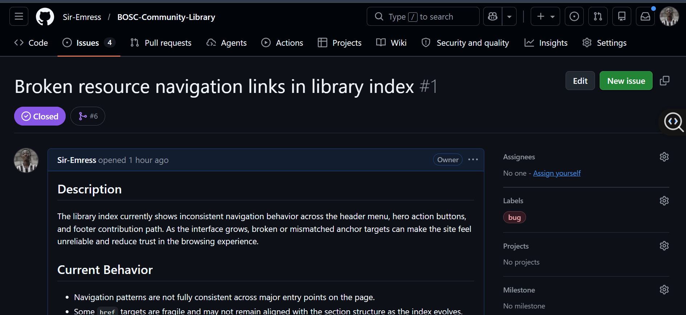

**Description:**  
This screenshot shows Issue #1 in its "Closed" state on the GitHub issue tracker, following the successful merge of the navigation fix.

It is relevant to OSS workflow assessment because it confirms the completion of the issue lifecycle, from initial reporting to resolution and closure, providing traceability for maintenance tasks.

---

### Repository Branch Workflow
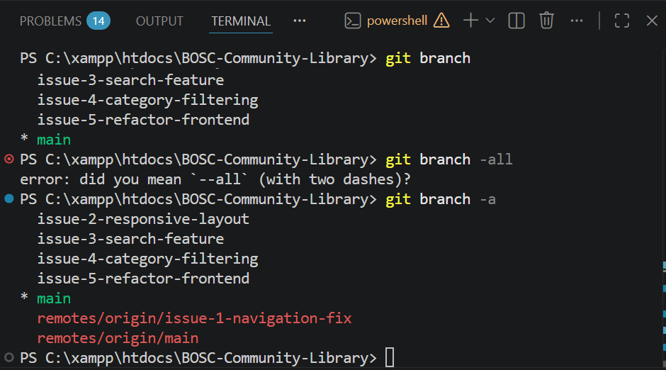

**Description:**  
This screenshot documents the branch structure used during development, showing the transition from the dedicated feature branch back to the main branch.

It is relevant to OSS workflow assessment because it evidences a disciplined branching strategy where specific fixes are isolated in feature branches before being integrated, maintaining the stability of the core codebase.

---

### Navigation Fix Local Verification
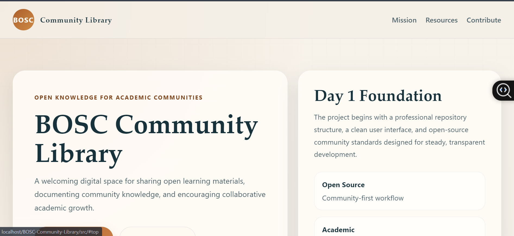

**Description:**  
This screenshot shows the localhost interface after the navigation fix, demonstrating correct anchor resolution and scroll-padding behavior for the sticky header.

It is relevant to OSS workflow assessment because it verifies that the technical implementation resolved the reported functional defect in a real deployment environment.

---

### Day 4 Screenshots

The following authenticated screenshots document the implementation of responsive layout improvements and mobile-specific design refinements.

### Issue #2 Pull Request (PR #7)
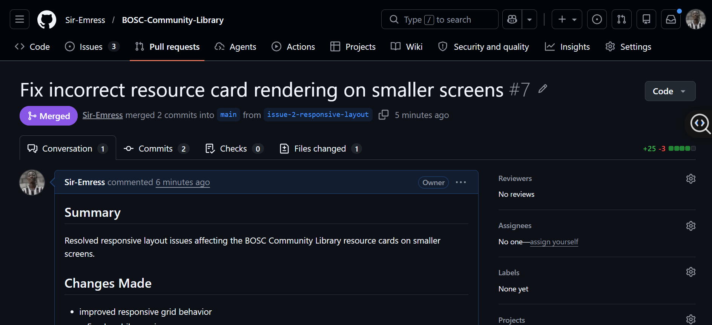

**Description:**  
This screenshot displays the GitHub pull request (#7) for the responsive layout bug fix. It details the adjustments made to CSS grid breakpoints and card padding.

It is relevant to OSS workflow assessment because it illustrates the professional handling of UI regressions and the iterative refinement of frontend components through standard collaborative tools.

---

### Issue #2 Closed Status
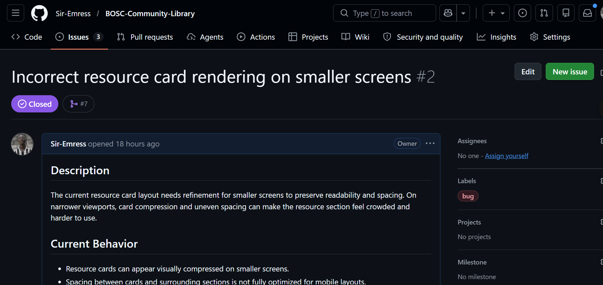

**Description:**  
This screenshot shows the closed state of Issue #2 on GitHub, linked to the merged pull request that addressed mobile layout inconsistencies.

It is relevant to OSS workflow assessment because it supports the audit trail of the project's technical evolution, proving that identified layout defects were systematically addressed.

---

### Responsive Layout Improvements
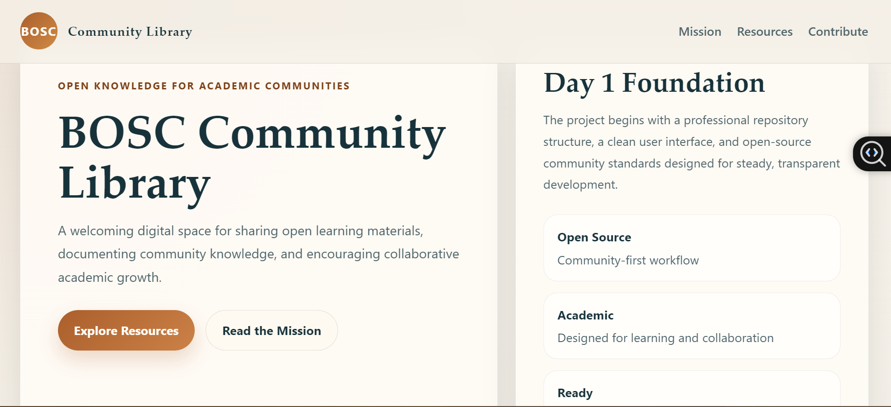

**Description:**  
This screenshot shows the desktop layout after refinements to the grid system and visual hierarchy, ensuring consistency across different screen widths.

It is relevant to OSS workflow assessment because it demonstrates a commitment to UI quality and maintainable CSS architecture during the feature enhancement phase.

---

### Mobile View Compatibility Test
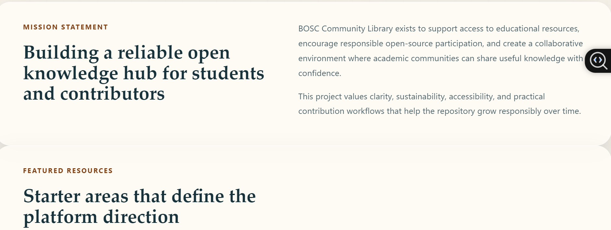

**Description:**  
This screenshot captures the mobile-specific rendering of the library, showing optimized card stacking and readable typography on smaller viewports.

It is relevant to OSS workflow assessment because it confirms that the project adheres to mobile-first responsive design standards and has been validated against diverse user environments.

---

### Day 5 Screenshots

The following authenticated screenshots document the development of the searchable resource filtering system and functional validation.

### Issue #3 Pull Request (PR #8)
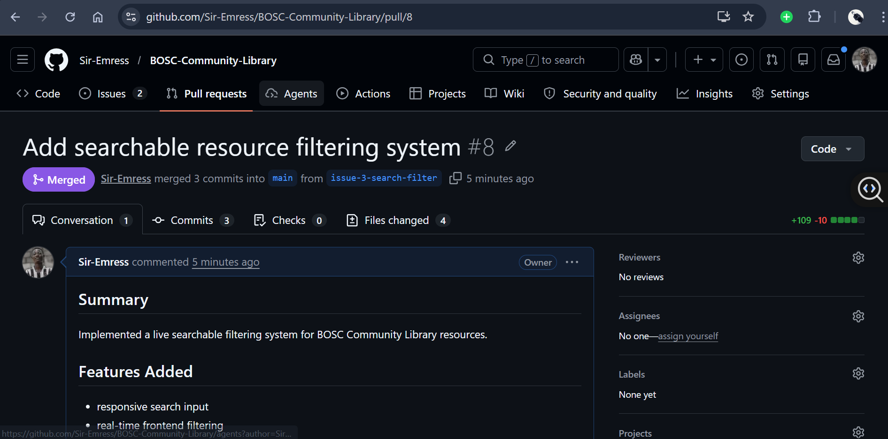

**Description:**  
This screenshot shows the pull request (#8) for the searchable resource filtering feature, documenting the JavaScript logic and interface additions.

It is relevant to OSS workflow assessment because it provides a record of feature expansion where new functionality is introduced through a structured review process rather than direct commits to the main branch.

---

### Issue #3 Closed Status
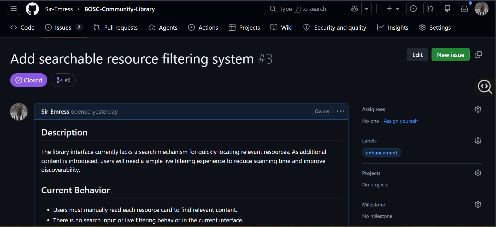

**Description:**  
This screenshot verifies the closure of Issue #3, marking the successful implementation of the search system.

It is relevant to OSS workflow assessment because it completes the documentation for the first major functional enhancement, linking the requirement to the final verified implementation.

---

### Search System Interface
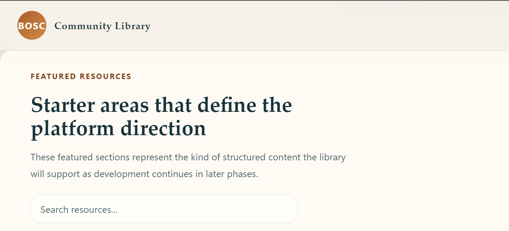

**Description:**  
This screenshot shows the user interface for the search system, including the responsive input field and the integrated filtering controls.

It is relevant to OSS workflow assessment because it highlights the transition from a static library to an interactive application, demonstrating increased technical complexity.

---

### Live Search Results Verification
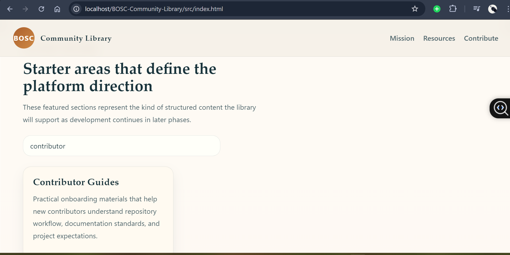

**Description:**  
This screenshot demonstrates the search functionality in action, showing the real-time filtering of resource cards based on user queries.

It is relevant to OSS workflow assessment because it proves the functional correctness of the implementation and validates the performance of the client-side filtering logic.

---

### Day 6 Screenshots

The following authenticated screenshots document the implementation of categorized browsing and the comprehensive frontend architecture modernization.

### Issue #4 & #5 Pull Request (PR #9)
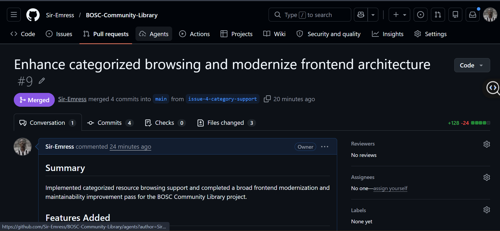

**Description:**  
This screenshot captures the major pull request (#9) which combined the categorized browsing system with a broad frontend architecture refactor.

It is relevant to OSS workflow assessment because it demonstrates how maintenance and feature work can be consolidated into comprehensive enhancement passes while maintaining clear documentation and review standards.

---

### Modernized Academic Homepage

**Description:**  
This screenshot shows the finalized academic UI, featuring refined typography, modernized spacing systems, and a professional color palette.

It is relevant to OSS workflow assessment because it shows the project reaching "production-ready" quality, evidencing high standards of frontend design and code organization.

---

### Category Filter UI Interface
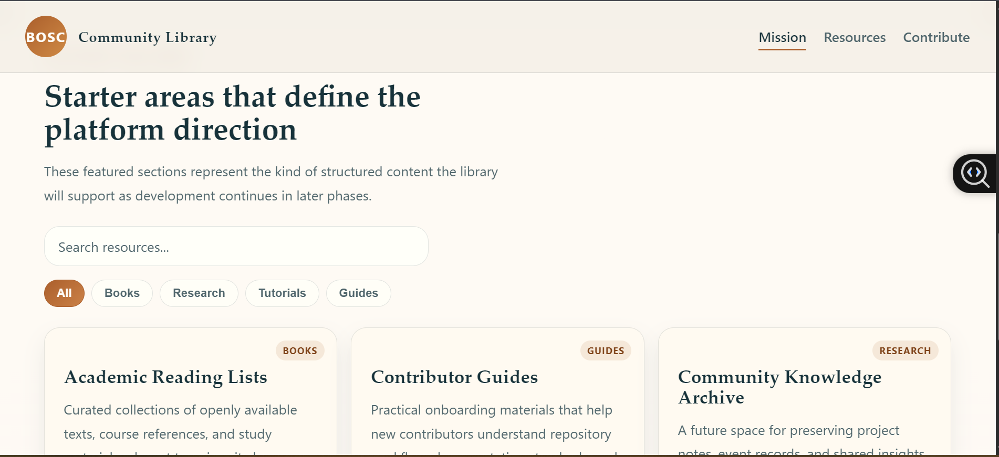

**Description:**  
This screenshot documents the interactive category filtering controls, showing active states and accessible button design.

It is relevant to OSS workflow assessment because it demonstrates advanced interaction design and accessibility compliance within a vanilla JavaScript architecture.

---

### Combined Search and Category State
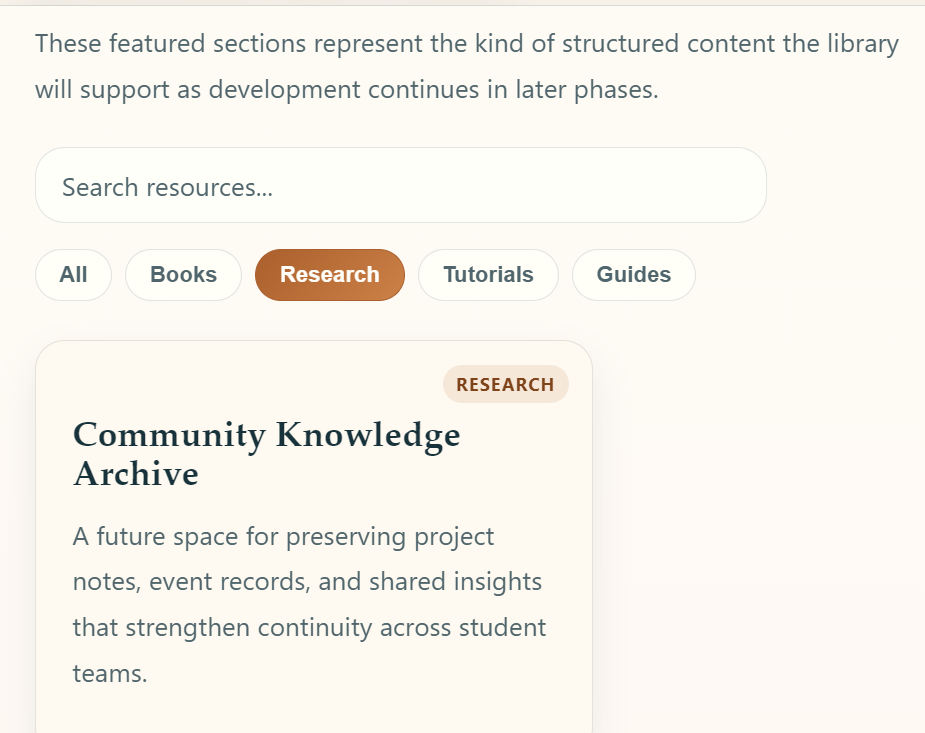

**Description:**  
This screenshot shows the intersection of search queries and category filters, proving the robustness of the underlying state management logic.

It is relevant to OSS workflow assessment because it validates the final architectural improvements and ensures that the system handles complex user interactions without regression.

---

### Day 7 Screenshots

The following screenshots document the final state of the repository prior to submission.

### Final GitHub Contribution Graph
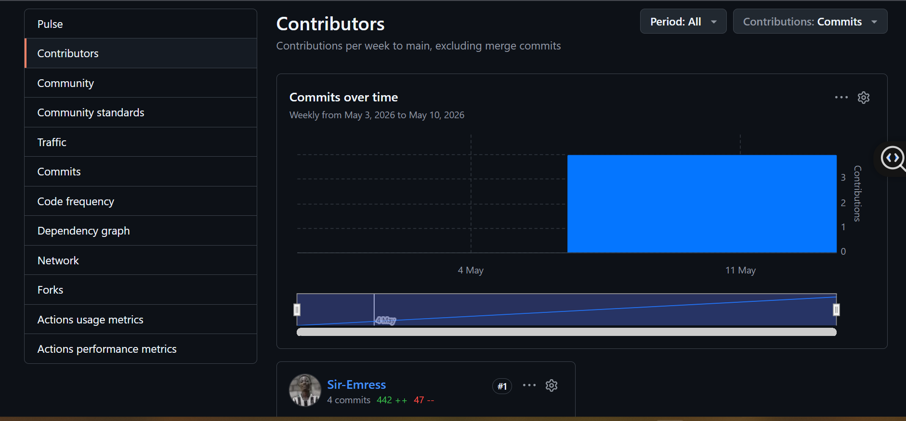

**Description:** Shows the distributed activity over the 7-day exam period, confirming consistent effort.

---

### Final Git History Graph
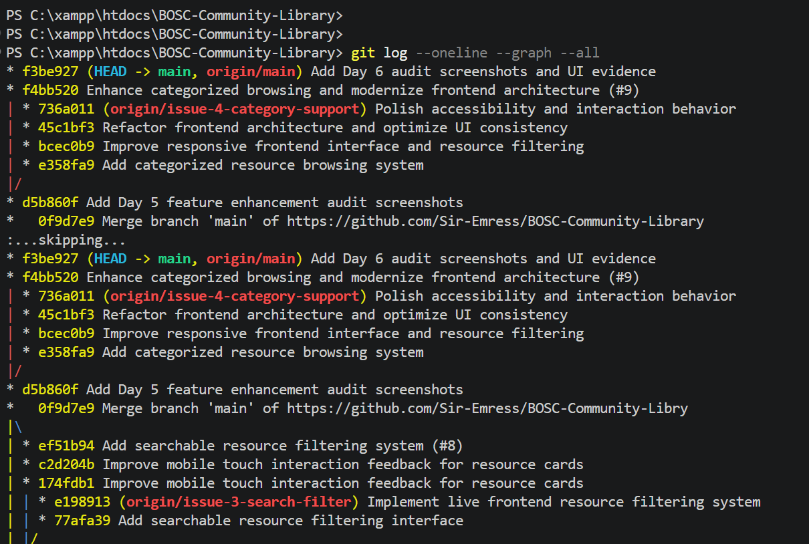

**Description:** A complete `git log --graph` showing the merge history of all 5 issues.

---

### Final Repository State
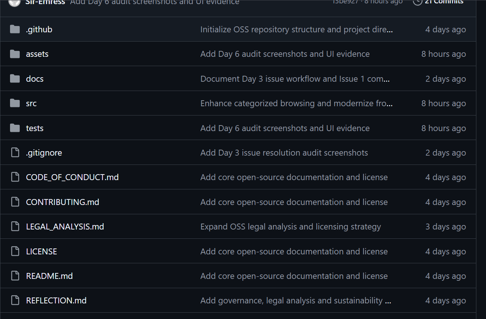

**Description:** The root of the GitHub repository showing all required OSS files and zero open issues.

---

### All Issues Closed
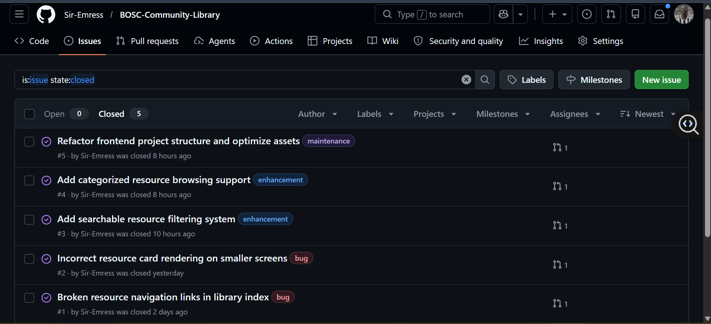

**Description:** The GitHub issues tab filtered by "is:closed," showing issues #1 through #5.

---

### All Pull Requests Merged
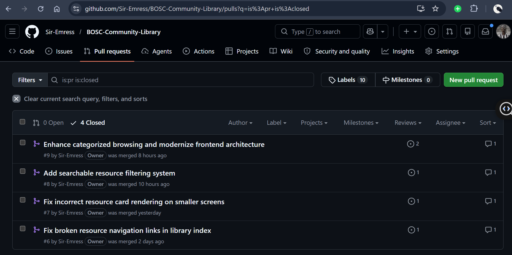

**Description:** The GitHub pull requests tab showing merged PRs #6 through #9.

---

## 5. Day 1 Completion Summary

Day 1 development activity concluded with the successful establishment of the repository foundation and supporting audit evidence. The project reached a stable baseline suitable for continued staged development and academic review.

- Repository initialized successfully with foundational project directories and tracked source files.
- GitHub integration completed through connection of the local repository to the configured remote origin.
- OSS governance files established, including contributor guidance, conduct standards, licensing, legal review, sustainability notes, and project reflection materials.
- Frontend environment operational via XAMPP, with the initial interface running locally from the `src/` directory.
- Audit evidence captured successfully through commit history, repository overview, editor structure, and localhost execution screenshots.

## 6. Day 2 Completion Summary

Day 2 development activity focused on strengthening the legal and governance maturity of the repository through structured documentation work and supporting evidence capture.

- Legal analysis successfully expanded into a fuller open-source licensing strategy document.
- OSS licensing strategy documented with explicit comparison between MIT, Apache 2.0, and GNU GPL.
- Public-sector implications evaluated in relation to transparency, auditability, vendor independence, and sustainable local maintenance.
- GitHub activity continued incrementally through separate documentation and audit-oriented updates rather than a single combined change.
- Audit evidence captured for compliance through screenshots of the legal analysis document, Git history, and hosted repository updates.

## 7. Evidence Storage Notes

- All Day 1 and Day 2 screenshots are stored in `assets/screenshots/` and embedded in this document using repository-relative Markdown paths.
- Screenshots were captured progressively during development rather than reconstructed after completion.
- The evidence archive supports the authenticity of workflow activity by linking visual proof to real repository, development environment, and version control milestones.
- Future evidence for Days 3 to 7 should be stored using the same organized structure to preserve consistency across the full audit timeline.

## 8. Issues and Pull Request Tracking

Update this section only after the issue or pull request exists on GitHub. Replace `TO BE UPDATED` with the real title, link, status, and resolution details.

### Issues Created

| Issue Ref | Category | Title / Link | Status |
| --- | --- | --- | --- |
| Issue 1 | Functional Bug Fix | [Broken resource navigation links in library index](https://github.com/Sir-Emress/BOSC-Community-Library/issues/1) | Closed |
| Issue 2 | Functional Bug Fix | [Incorrect resource card rendering on smaller screens](https://github.com/Sir-Emress/BOSC-Community-Library/issues/2) | Closed |
| Issue 3 | Feature Enhancement | [Add searchable resource filtering system](https://github.com/Sir-Emress/BOSC-Community-Library/issues/3) | Closed |
| Issue 4 | Feature Enhancement | [Add categorized resource browsing support](https://github.com/Sir-Emress/BOSC-Community-Library/issues/4) | Closed |
| Issue 5 | Refactoring Task | [Refactor frontend project structure and optimize assets](https://github.com/Sir-Emress/BOSC-Community-Library/issues/5) | Closed |

### Pull Requests

| PR Ref | Linked Issue | Title / Link | Status |
| --- | --- | --- | --- |
| PR 1 | Issue 1 | [Fix broken resource navigation links in library index](https://github.com/Sir-Emress/BOSC-Community-Library/pull/6) | Merged |
| PR 2 | Issue 2 | [Fix incorrect resource card rendering on smaller screens](https://github.com/Sir-Emress/BOSC-Community-Library/pull/7) | Merged |
| PR 3 | Issue 3 | [Add searchable resource filtering system](https://github.com/Sir-Emress/BOSC-Community-Library/pull/8) | Merged |
| PR 4 | Issue 4, Issue 5 | [Enhance categorized browsing and modernize frontend architecture](https://github.com/Sir-Emress/BOSC-Community-Library/pull/9) | Merged |

## 9. Audit Compliance Notes

- This project follows a 7-day incremental development model aligned with academic open-source project assessment.
- Day 2 development focused on legal governance, open-source licensing analysis, and documentation quality rather than feature expansion.
- All commits should be distributed across the development timeline rather than uploaded in a single batch.
- Repository activity remained distributed across the timeline, and documentation updates were committed incrementally.
- Screenshots should be captured daily and stored as authentic evidence of actual work completed.
- GitHub issue activity, pull request history, and the contribution graph form part of the official assessment evidence.
- Audit entries should be updated immediately after each work session to preserve accuracy and traceability.

## 10. Contribution Integrity Statement

> "This submission represents an iterative open-source development process demonstrating real-world repository management, issue tracking, and collaborative software engineering practices."
